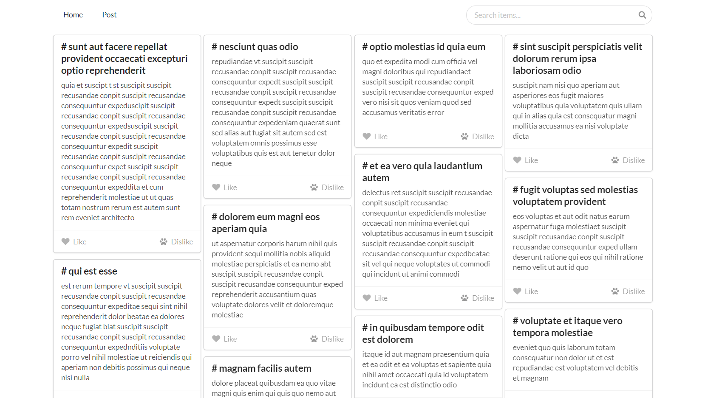

# Chaggie

### Vue中使用semantic-ui-css

1. `npm i semantic-ui-css -s`

2. `main.js`中引入`import "semantic-ui-css/semantic.min.css";`

3. `App.vue`中使用

   ```js
   <template>
     <div id="app">
       <button class="ui button">Follow</button>
     </div>
   </template>
   ```


### column-count实现瀑布流布局



```html
<template>
  <div id="cardlist" :style="{columnCount:columnCount }">
    <card-item class="carditem" v-for="item in mocks" v-bind:key="item.id" :item="item"></card-item>
  </div>
</template>

<style scoped>
#cardlist {
  column-gap: 0.5vw;
  padding-top: 0.5vw;
}
.carditem {
  position: relative;
  width: 24vm;
  margin-bottom: 1vm;
  break-inside: avoid;
}
</style>
```


### Project setup

```
npm install
```

#### Compiles and hot-reloads for development

```
npm run serve
```

#### Compiles and minifies for production

```
npm run build
```
